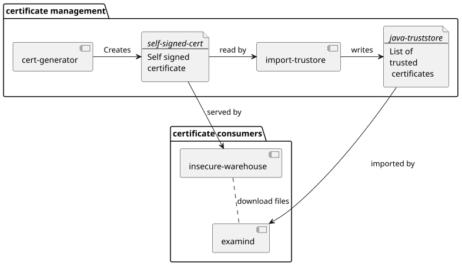
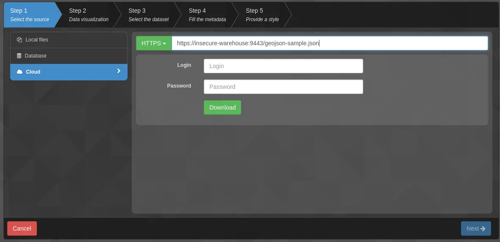

# Examind Compose configurations

This folder contains multiple configurations to launch Examind in specific use-cases

## Standard configuration

_Run it using:_

```bash
docker compose up
```

This configuration deploys Examind in debug mode (for development environment).
A PostGIS database is deployed along it, to serve as administration database.
It can also be used to store Sensor related datasets (SensorThings, SOS).

To launch this configuration, run the default configuration file ([compose.yaml](./compose.yaml)) using your favorite compose engine.
Example: `docker compose up`

## Embedded database

_Run it using:_

```bash
docker -f compose-embedded-db.yaml compose up
```

Minimal configuration that runs a single Container (which runs a single JVM) to run both Examind and its administration database.
The database is opened as an embedded database file using HsqlDB.
In this mode, it is not possible to use the database to store sensor datasets, and if your need to use Sensor services (SensorThings, SOS), you will have to run and connect your own database separately.

To launch, use the [compose-embedded-db.yaml](./compose-embedded-db.yaml) file.
Example: `docker compose -f compose-embedded-db.yaml up`

## Self-signed certificate consumption

_Run it using:_

```bash
docker -f compose-self-signed-cert.yaml compose up
```

This example demonstrate how to import a self-signed certificate in Examind JVM truststore, to be able to contact third-party services hosted on a specific self-signed certificate.

This example is composed of the following services:



1. An openssl client generates a temporary self-signed certificate.
2. A simple HTTP server host a sample file behind the self-signed certificate
3. The certificate is imported in a temporary java truststore
4. The truststore is imported by examind, to be able to trust and reach files/services hosted by the self-signed certificate.

To test this, start the compose configuration, then download sample data file by adding `https://insecure-warehouse:9443/geojson-sample.json` file in Examind add data form (Data > Add data > Cloud > HTTP):



Note that in the compose file, if you remove the line:

>         -Djavax.net.ssl.trustStore=/tmp/truststore/cacerts

Then Examind uses the default java trust store, and the file is not downloadable anymore.
